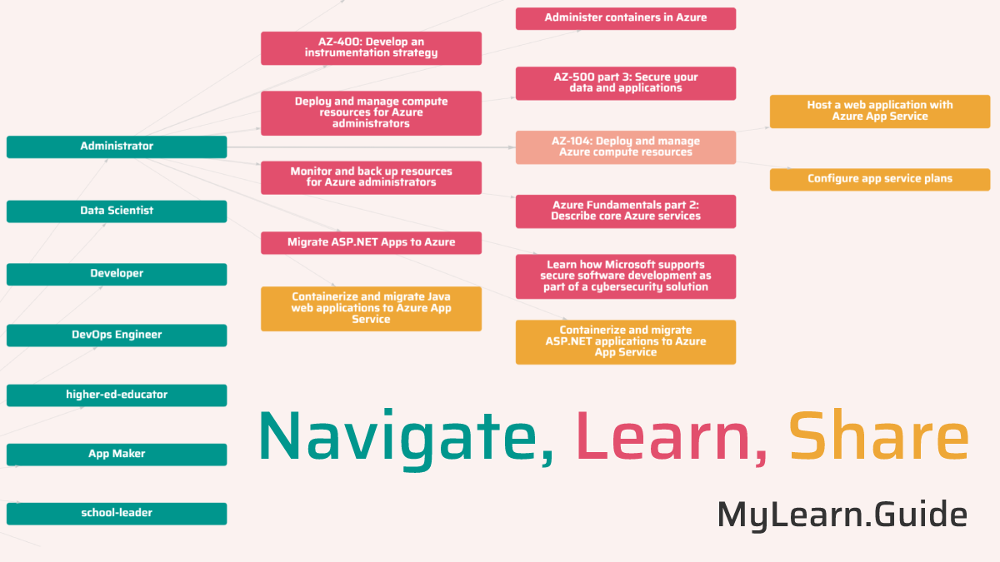

# MS Learn Utilities

Set of tools to provide better experience for the learners and educators on MS Learn.

- Utility #1: Total learning time calculator for Collection and Challenges

    

### Try this in action

[https://aka.ms/mslearn-util](https://aka.ms/mslearn-util)

## Available Scripts

In the project directory, you can run:

### `npm run start`

Runs the app in the development mode.\
Open [http://localhost:3000](http://localhost:3000) to view it in the browser.

The page will reload if you make edits.\
You will also see any lint errors in the console.

### `npm run build`

Builds the app for production to the `build` folder.\
It correctly bundles React in production mode and optimizes the build for the best performance.

The build is minified and the filenames include the hashes.\
Your app is ready to be deployed!

See the section about [deployment](https://facebook.github.io/create-react-app/docs/deployment) for more information.

### Author

[Maxim Salnikov](https://twitter.com/webmaxru). Feel free to contact me if you have any questions about the project, PWA, Azure Static Web Apps.

